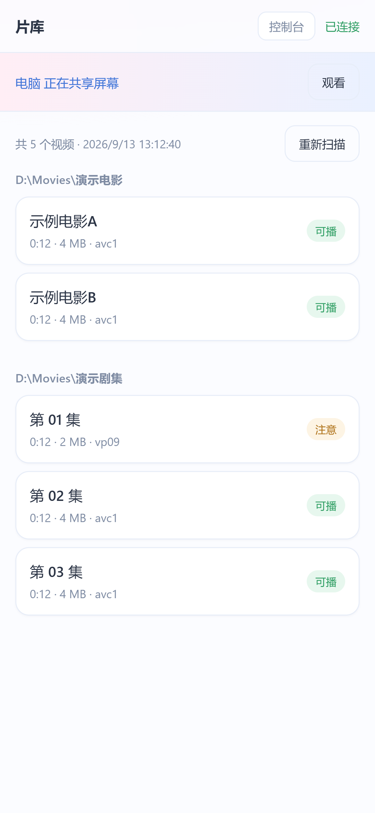
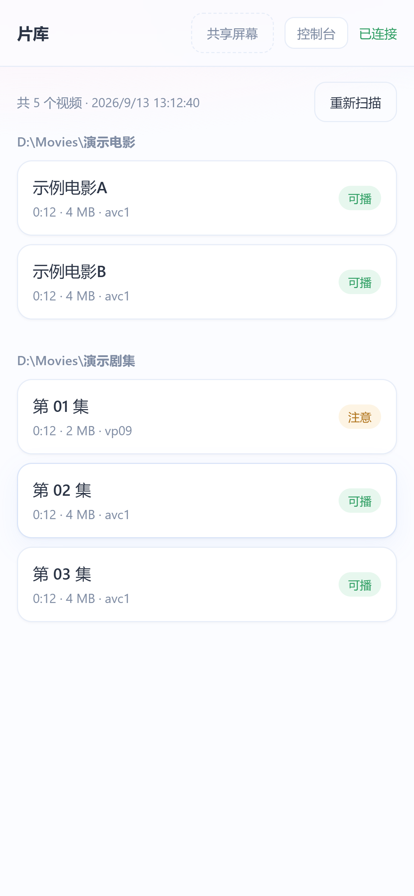
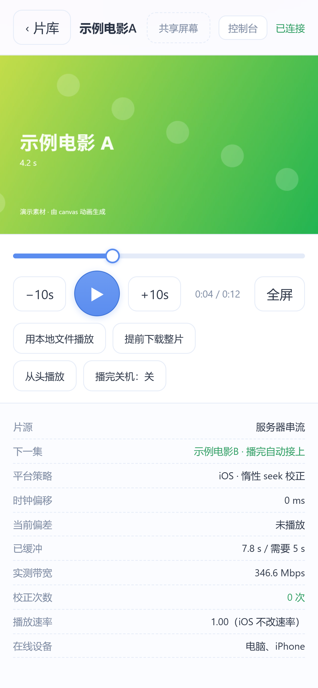
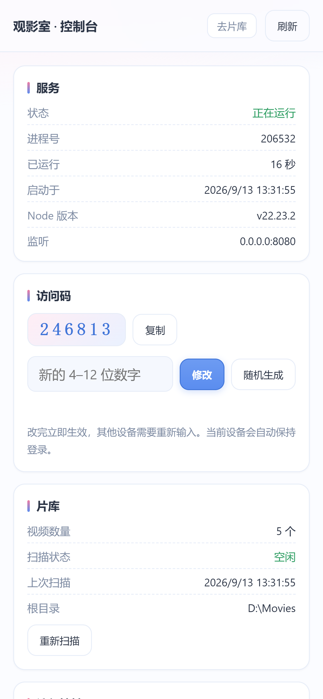
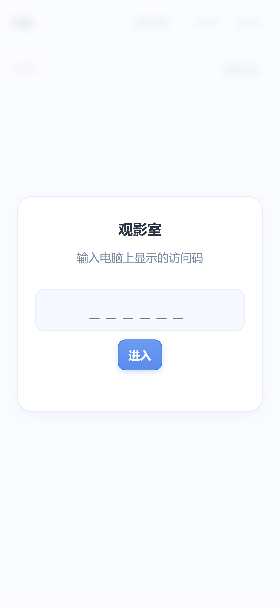
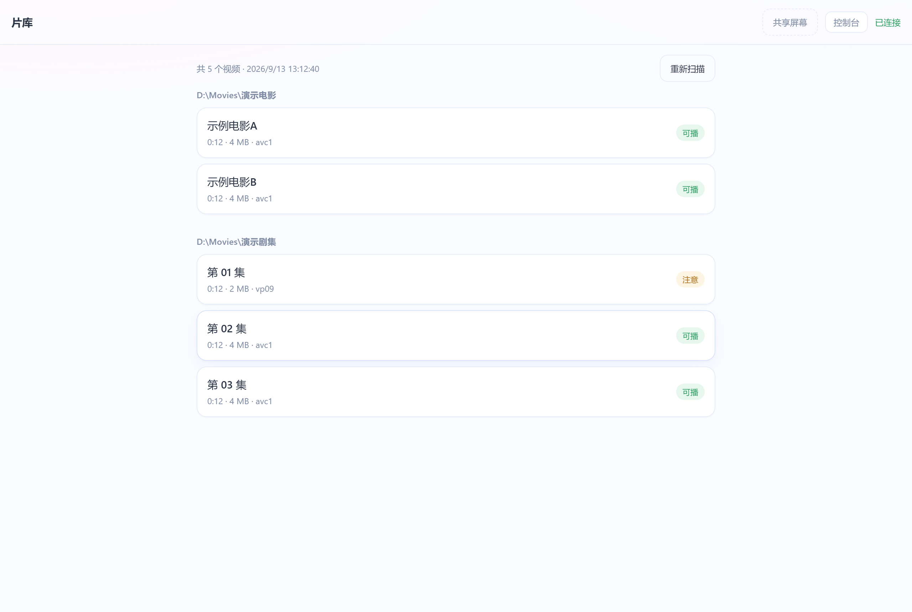

# 观影室 (video-watcher)

两个人异地看同一部片子，进度完全同步，**视频内容不经过任何第三方**。

电脑只当"文件服务器 + 时间轴服务器"，不播放、不解码、不转码；两台设备各自从电脑拉原始码率自行解码；同步靠一条 WebSocket 广播权威时间轴。

完整设计见 [PLAN.md](./PLAN.md)。

## 几台设备能一起看？

**架构上没有硬上限，真正的瓶颈只有一个：你家的上行带宽。**

每个观看端都要从你这台电脑拉完整码率的视频（不解码、不转码，所以**服务端 CPU 几乎不随人数增长**）。实测你的片源：

| 片源 | 平均码率 |
|---|---|
| 电影 1 / 2 | 4.7 / 4.5 Mbps |
| 示例剧集 | 约 5.5 Mbps |
| **平均** | **5.4 Mbps** |

按上行带宽推算：

| 你的上行 | 理论上限 | 建议同时观看 |
|---|---|---|
| 20 Mbps | 3 路 | 2 路 |
| 30 Mbps | 5 路 | 4 路 |
| 50 Mbps | 9 路 | 8 路 |
| 100 Mbps | 18 路 | 17 路 |

**两个重要的修正因素**：

1. **局域网内的设备不占上行带宽。** 你在家用自己的电脑/手机看，走的是本地网络；
   只有异地的人才会消耗国际出口。所以"你 + 她"实际只需要 **1 路 = 约 5.4 Mbps**。
   上表的数字请理解成"**异地观看端**的数量"。
2. **房间是"等最慢的人"策略**：任何一台设备缓冲不足，所有人一起暂停。
   两个人时这是对的（保证同步），但人一多就会变成"被最慢的那个拖住"。
   如果你以后真的要开给更多人看，告诉我，我可以加一个"落后太多就自己追、不拖住大家"的降级模式。

另外注意上行带宽是**共享**的：如果同时还在跑下载、网盘同步、或者分享屏幕，会互相抢。

---

## 共享屏幕

**可以，已经做了。** 入口在**页面右上角、控制台旁边**：「共享屏幕」按钮。

按钮**始终显示**。如果你那台设备当前不能采集，它的边框会是虚线，点一下会明确告诉你原因
（而不是凭空消失让人以为没这个功能）。

### 谁共享、谁观看

房间是共享的：**谁都可以共享，其他所有人都会看到提示** —— 包括你自己的另一台设备。

1. **共享端**（必须是能采集屏幕的那台设备，也就是电脑）：
   在电脑上用 `http://127.0.0.1:8080` 打开 → 右上角点「共享屏幕」→
   浏览器弹出选择框 → 选一个屏幕 / 窗口 / 标签页
2. **观看端**（手机、她的 iPhone、其他电脑都算）：
   页面上会出现一条提示条「**电脑 正在共享屏幕**」+「观看」按钮，
   **不需要先选片子**，在片库页就能看到。点「观看」即进入全屏画面。

| 手机上看到提示条 | 点「观看」后的画面 |
|---|---|
|  |  |

片库列表上方会冒出一条粉蓝渐变的提示条（**不需要先选片子**），
点「观看」后进入全屏画面层，右下角有「声音」「全屏」「关闭」三个按钮。

### 画质预设与实时指标

共享画面底部会实时显示链路指标，共享端还能随时切换画质预设（**切换是实时的，不用重连**）：

| 预设 | 帧率 | 码率上限 | 带宽不足时 | 适合 |
|---|---|---|---|---|
| 流畅 | 60 | 12 Mbps | 保帧率（主动降分辨率） | **游戏、动作画面** |
| 均衡（默认） | 60 | 8 Mbps | 保帧率 | 一般观看 |
| 清晰 | 30 | 8 Mbps | 保分辨率 | 文档、代码、文字 |

「流畅」会主动把分辨率降到 2/3（`scaleResolutionDownBy: 1.5`）来换取码率余量 ——
这比让 WebRTC 自己乱降更可控。预设还会设置 `contentHint`，告诉编码器
这是「运动画面」还是「细节画面」，浏览器的编码策略会跟着变。

### 卡顿到底是不是网络的锅？

共享端的指标里有一项 **「受限」**，它直接回答这个问题 ——
数据来自 WebRTC 的 `qualityLimitationReason`，不是估算：

| 显示 | 含义 | 怎么办 |
|---|---|---|
| 受限：带宽不足（网络） | 上行带宽喂不过来 | 切「流畅」预设、关掉同时在跑的上传任务、改用有线网 |
| 受限：编码器跟不上（本机性能） | 本机编码压力太大 | 切「流畅」；降分辨率比降帧率更能减轻编码负担 |
| 不显示「受限」 | 链路和编码都没到瓶颈 | — |

指标里还会显示实际发送/接收的 **帧率、分辨率、实时码率、RTT、丢包数**。

**前一两秒的数字偏低是正常的** —— 那是 WebRTC 的带宽估计还在爬升，编码器从低码率起步，
几秒后会自己爬到稳态（实测稳态可达 1280×720 / 60 fps）。

### 用作游戏直播时要注意

- **上行带宽是硬门槛，而且按观看人数翻倍。** 画面走 P2P 直连，你能上传多少直接决定画质：
  1 个观看者 ≈ 1 路码率，2 个就是 2 路。1080p60 的游戏画面建议留 **10–12 Mbps** 余量。
- **共享「整个屏幕」，不要共享单个窗口。** Windows 上只有整屏共享才会出现
  「分享系统音频」选项；而且整屏采集走的是桌面复制通道，帧率上限更高。
- 游戏尽量**独占全屏**，窗口模式在部分机器上采集帧率会明显偏低。
- 本机同时开着下载、网盘同步等上传任务时，上行会被抢走，指标里的「受限：带宽不足」会立刻出现。
- **分辨率和帧率是一对矛盾**，码率给不够时必须牺牲一个：
  默认的「均衡/流畅」是保帧率（宁可画面糊一点也不卡顿），
  画面内容变化越剧烈（游戏、动作片、全屏渐变）编码越吃力，分辨率就越容易被压低 ——
  这是正常的，看指标里的分辨率和码率就知道。文字内容请改用「清晰」预设。
- 基准线可调：`rtc.frameRate`（默认 60）、`rtc.maxBitrateMbps`（默认 8）、
  `rtc.degradationPreference`（默认 `maintain-framerate`，即保帧率）。

### 手机上全屏

共享画面右下角有「全屏」按钮。iPhone 上用的是视频元素的原生全屏
（Safari 不允许对普通元素调 `requestFullscreen`），桌面浏览器上则用标准全屏 API。

> 竖屏手机看 16:9 的共享画面时，上下会有黑边 —— 这是「完整显示不裁切」的正确行为。
> 点全屏后把手机横过来即可铺满。

### 声音

共享时会**连系统声音一起采**，观看端默认静音（浏览器的自动播放策略不允许无操作带声播放），
点「观看」时会在那个点击手势里自动打开声音；如果没打开，画面层右下角会有「开启声音」按钮，
点一下即可。按钮是开关式的，可以随时静音。

**⚠️ Windows 上的关键一步**：浏览器弹出的选择框里，
**只有选「整个屏幕」时才会出现「分享系统音频」这个勾选项** ——
选单个窗口或标签页时通常不给系统声音。所以想连声音一起共享，请：

1. 选「**整个屏幕**」
2. **勾上左下角的「分享系统音频」**

没勾的话就只有画面没有声音，而且不会报错 —— 这是最容易踩的坑。

另外两条边界：

- **共享端自己的预览永远静音**，否则会自己听自己产生啸叫。你在电脑上本来就能听到本机声音，
  不需要从预览里再听一遍。
- **Safari 不支持采集系统声音**（它连屏幕采集的支持都很有限）。所以共享端只能是
  Windows/Mac 上的 Chrome / Edge。

### 技术上

- 画面走 **WebRTC 直连（P2P）**，**不经过服务端**。服务端只转发 SDP 和 ICE 候选，
  所以共享屏幕不会让画面经过这台机器之外的任何地方，也不额外消耗服务器的带宽
- 共享端给每个观看者各建一条连接，实测 3 台设备都能正常收到画面
- 共享者断开连接时，共享状态会自动结束，不会让人一直等一个不会来的画面

### 为什么必须用 `127.0.0.1`

浏览器的 `getDisplayMedia`（采集屏幕）**只在安全上下文下可用**，实测结果：

| 地址 | 安全上下文 | 采集屏幕 | 接收画面 |
|---|---|---|---|
| `http://127.0.0.1:8080` | ✅ | ✅ | ✅ |
| `http://192.168.1.100:8080` | ❌ | ❌ | ✅ |

所以采集端现在只能是"在电脑上用 localhost 打开"这一种情形。
**等 HTTPS 配好之后（见 PLAN.md 地基 ①），任何设备都能共享屏幕**——
这也是 HTTPS 的第二個实际收益，第一个是让她 iPhone 能拿到 Wake Lock（不然屏幕会自己灭掉）。

跨洋使用还需要能直连：如果你家有公网 IP，WebRTC 通常能直接打通；
打不通时需要在 `config.json` 的 `rtc.iceServers` 里配 STUN/TURN
（默认是**空**的 —— 不配任何第三方 STUN，以保持"不经过第三方"这个性质）。

---

## 界面

浅粉 / 浅蓝 / 白的简洁风格，手机优先。

片库、播放器、控制台三套页面共用同一套浅色主题，手机优先。

| 片库（手机） | 播放器（手机） |
|---|---|
|  |  |

| 控制台（手机） | 登录 | 片库（桌面） |
|---|---|---|
|  |  |  |

> 仓库里的截图用的是**合成的演示片库** —— `node tools/make-demo-clips.js` 用 canvas 动画
> 录成的真实 MP4，不含任何个人内容。想看你自己的界面，运行 `node tools/screenshot.js`。

---

## 快速开始

双击 `tools/start.bat`，或在项目目录执行：

```powershell
npm install
npm start
```

启动后控制台会打印 **访问码（PIN）** 和可用地址，例如：

```
  访问码 (PIN): 123456

  本机可用地址:
    http://127.0.0.1:8080
    http://192.168.1.100:8080    （局域网 · WLAN）
```

手机浏览器打开 `http://<电脑IP>:8080`，输入访问码即可。

> 首次启动会自动生成 PIN 并写入 `config.json`。想改就改那个文件里的 `pin` 字段。

---

## 启动、停止与开机自启

服务是一个 **Node 进程**，不会随电脑启动而自动运行 —— 除非你按下面注册成自启。
另外它必须一直开着，所以还需要**关掉系统睡眠**（屏幕可以关）。

### 三种启动方式

| 方式 | 命令 | 特点 |
|---|---|---|
| 前台启动 | 双击 `tools\start.bat` | 有控制台窗口，方便看日志和排查 |
| 后台启动 | 双击 `tools\start-hidden.vbs` | 无窗口，日志写到 `data\server.log` |
| 开机自启 | `install-autostart.ps1` 注册后由计划任务拉起 | 用上面的后台方式，无需你操作 |

### 注册开机自启

```powershell
# 查看当前状态（自启是否已注册 + 服务是否在运行）
powershell -ExecutionPolicy Bypass -File tools\install-autostart.ps1 -Status

# 注册：登录 Windows 后延迟 20 秒自动启动（不需要管理员权限）
powershell -ExecutionPolicy Bypass -File tools\install-autostart.ps1

# 注册：开机即启动，不需要登录（需要管理员权限）
powershell -ExecutionPolicy Bypass -File tools\install-autostart.ps1 -Mode Boot

# 取消自启
powershell -ExecutionPolicy Bypass -File tools\install-autostart.ps1 -Remove
```

**两种模式怎么选**：

- 你平时会登录这台电脑 → 用默认的**登录时启动**就够，简单、不需要管理员
- 电脑可能在没人登录时重启（比如半夜自动更新完重启，而你第二天直接从手机连）
  → 用 `-Mode Boot`，它以 SYSTEM 身份运行，不需要任何人登录

### 停止服务

```powershell
powershell -ExecutionPolicy Bypass -File tools\stop-server.ps1
```

### 配套的两个一次性设置

1. **防睡眠**（很重要，否则看片中途电脑睡了会直接断流）：
   ```powershell
   powershell -ExecutionPolicy Bypass -File tools\prevent-sleep.ps1 -Enable
   ```
   （需要管理员权限）

2. **日志**：后台运行时看不到控制台，日志在 `data\server.log`。
   里面有启动信息、片库扫描结果、谁选了什么片、自动连播和关机的记录。

> 服务启动时会检查 `data\server.pid`，如果发现已有实例在跑就会直接退出并提示，
> 不会出现两个进程抢 8080 端口的情况。

### 空载占用（实测）

没人看的时候它几乎不存在：

| 指标 | 实测值 |
|---|---|
| CPU | 30 秒采样内消耗 **0 ms**（0.000%） |
| 内存 | 66 MB 工作集 |
| 网络 | 只有 1 个监听套接字，**0 个已建立连接，无任何对外连接** |
| 磁盘 | 无文件监听，片库只在启动或手动重扫时读取 |

原因是**没有任何轮询**：所有行为都是事件驱动的（有人连上来才动）。片库索引读一次就缓存，
不反复扫盘；片源文件只在有人真的在看时才会被读。

页面开着但没选片时也是安静的：客户端会跳过位置上报，只保留每 5 秒一次的心跳（几十字节）。
真正看片时它也只是把原始码率的视频字节转发给你，不转码、不解码。

---

## 控制台（`/admin.html`）

浏览器打开 `http://<电脑地址>:8080/admin.html`，或者在片库页面右上角点「控制台」。
不用再记 PowerShell 命令，手机上也能用。

能做的事：

- 看服务状态：进程号、已运行多久、监听地址、Node 版本
- **看和改访问码**（改完立即生效，当前设备自动保持登录，其他设备需重新输入）
- 看片库状态、一键重新扫描
- 看局域网访问地址（手机照着输就行）
- 开机自启的注册 / 移除 / 状态查看
- 播完关机的开关与取消
- 观看断点：看有哪些断点、一键清空
- 直接看 `data\server.log` 的尾部，不用去翻文件

**有一点要说明**：开机自启的注册/移除是通过调用系统命令 `schtasks` 实现的。
如果你的环境不允许服务端创建子进程（某些安全策略会拦），控制台会明确告诉你，
并提示改用管理员 PowerShell 跑 `tools\install-autostart.ps1`。
读取状态和改访问码不受影响。

> 控制台本身是网页，所以**公网暴露时必须靠访问码保护**。它需要和片库一样的鉴权才能访问，
> 没有访问码只能看到一个登录框。

---

## 修改访问码

访问码存在 `config.json` 的 `pin` 字段，服务启动时读取。用现成脚本改最省事：

```powershell
# 查看当前访问码
powershell -ExecutionPolicy Bypass -File tools\set-pin.ps1 -Show

# 指定一个新访问码（4–12 位数字），脚本会自动重启服务
powershell -ExecutionPolicy Bypass -File tools\set-pin.ps1 -Pin 826413

# 随机生成一个 6 位访问码
powershell -ExecutionPolicy Bypass -File tools\set-pin.ps1 -Random

# 只改配置不重启，下次启动才生效
powershell -ExecutionPolicy Bypass -File tools\set-pin.ps1 -Pin 826413 -NoRestart
```

也可以直接编辑 `config.json` 里的 `"pin"`，然后重启服务（`tools\stop-server.ps1` 再双击
`tools\start-hidden.vbs`）。把 `pin` 留空则下次启动会**自动生成一个新码**并写回配置文件。

脚本做了两件保护：写入前用 `.NET` 读写以避免 PowerShell 加上 BOM
（带 BOM 的 JSON 会让服务端直接解析失败），写入后再用 Node 校验一遍合法性，不合法就回滚。

> **改了访问码之后，所有设备都需要重新输入。** 会话令牌保存在服务进程内存里，
> 重启服务会清空它们 —— 这是有意的，避免旧令牌在改码后依然有效。

---

## 异地怎么用

三种地基，按推荐顺序（详见 PLAN.md §3.0）：

服务默认只监听局域网。**手机用流量（或对方在外地）是访问不到的** ——
`192.168.x.x` 是私有地址，只在你自己家的路由器内部有效。异地观看必须先解决"怎么连到你家这台电脑"。

| 方案 | 对方需要做什么 | 成本 | 备注 |
|---|---|---|---|
| ① **Tailscale**（推荐先试） | 装一次 App | ¥0 | 不用公网 IP、不用端口转发、不用证书，还能白拿 HTTPS |
| ② 公网直连 + 域名证书 | 点一个 `https://` 链接 | 域名 ¥0–100/年 | 需要路由器端口转发，服务会暴露在公网（靠访问码保护） |
| ③ WebRTC 推流 + 二维码 | 扫码 | 需改架构，开发量 3–5 倍 | 前两条都不通时的兜底 |

### 方案①：Tailscale（最省事，建议先试这条）

Tailscale 把两台设备放进同一个加密虚拟局域网（WireGuard，端到端加密，中继只转发密文），
之后用起来和同一 WiFi 完全一样，而且**不需要**公网 IP、端口转发、域名或证书。

**下载（国内可直连，不需要梯子）**：

- Windows：<https://pkgs.tailscale.com/stable/tailscale-setup-latest.exe>
- **Android：<https://pkgs.tailscale.com/stable/tailscale-android-universal-latest.apk>**
  —— 官方提供通用 APK，不需要 Google Play，下载后直接安装即可
- iOS：在 App Store 搜 Tailscale（注意：**中国区 App Store 没有这个 App**）

**步骤**：

1. 电脑装好并登录，手机装好并登录（**用同一个账号**，设备会自动进入同一个 tailnet）
2. 在电脑上执行 `tailscale serve 8080`
3. 手机会得到一个 `https://<机器名>.<你的tailnet>.ts.net` 地址，用它访问即可

第 2 步很值得做：它会自动签发受信任的 HTTPS 证书，于是手机端就是**安全上下文**，
从而解锁两件在普通 HTTP 下做不到的事 ——

- 手机播放时的**屏幕常亮**（Wake Lock），否则看片中途屏幕会自动熄灭、播放中断
- **手机也能共享屏幕**；另外任何设备都能共享屏幕，不再局限于在电脑上用 localhost 打开

> 关于打洞：Tailscale 在部分国内网络下的 UDP 打洞可能被劣化，从而退化成走中继。
> 判断方法：电脑上执行 `tailscale ping <对方设备名>`，如果显示 `direct` 就是直连，
> 显示 `relay` 就是走了中继。实测下来再用，必要时可以自建中继。

**无论用哪种，都先用这个地址验证连通性**（不需要 PIN）：

```
http://<电脑地址>:8080/api/health
```

能返回 `{"ok":true,...}` 就说明链路通了，剩下只是鉴权和播放的事。

---

## 常用命令

```powershell
npm start                      # 启动服务

node src/scan-cli.js           # 只扫描片库，打印每个文件的编码与 iOS 兼容性
node src/probe-cli.js <路径>   # 探测指定文件/目录的容器结构

node tools/check-network.js    # 网络地基自检：出口 IP / 路由器 WAN IP / 是否 CGNAT
node tools/test-room.js        # 房间状态机单元测试（不需要启动服务端，秒级）
node tools/test-progress.js    # 断点记忆与播完关机单元测试（关机走 dryRun，绝不真关）
node tools/test-sync.js        # 同步层集成测试（需服务端已启动）
node tools/test-hevc-patch.js  # 验证 hev1 传输时改写（需服务端已启动）
node tools/test-browser.js     # 真实浏览器端到端测试（用系统 Edge，两个独立上下文）
node tools/test-power-api.js   # 关机 API 测试（自动起隔离实例，不影响正式服务）
node tools/test-admin-api.js   # 控制台 API 测试（隔离配置副本 + 隔离任务名）
node tools/test-screen-share.js # 屏幕共享端到端测试
node tools/check-browser-caps.js # 探测浏览器能力（安全上下文 / 能否采集屏幕）
node tools/diag-disconnect.js  # 诊断：断开时房间状态广播了什么
node tools/screenshot.js       # 生成界面截图到 docs/screenshots/（改完样式用来核对）

# 可选：真正修改硬盘上的文件（本项目默认不需要，服务端会自动处理）
node src/fix-hevc-cli.js <路径>          # 预演
node src/fix-hevc-cli.js --apply <路径>  # 执行（只改 4 字节，不重新编码）
```

### 防睡眠（重要）

这台电脑要一直当服务器。屏幕可以关，但**系统不能休眠**，否则看片中途会直接断流。
需要管理员权限的终端：

```powershell
powershell -ExecutionPolicy Bypass -File tools\prevent-sleep.ps1           # 查看当前设置
powershell -ExecutionPolicy Bypass -File tools\prevent-sleep.ps1 -Enable   # 关闭睡眠/休眠
powershell -ExecutionPolicy Bypass -File tools\prevent-sleep.ps1 -Disable  # 恢复默认
```

---

## 片库：把片子丢进 `D:\Movies` 就行

片库根目录就是 **`D:\Movies`**，按文件夹分组显示。以后要加片，直接把文件（或整个文件夹）丢进去，
然后在网页上点「重新扫描」即可，不用改任何配置。

```
D:\Movies\
├─ 电影\
│   ├─ 示例电影A.mp4
│   └─ 示例电影B.mp4
└─ 示例剧集\
    ├─ 01.mp4 … 08.mp4, 9.mp4, 10.mp4
```

同一文件夹内的视频会按文件名自然顺序连播（`01 → 02 → … → 08 → 9 → 10`，数字排序正确）。

### 配置参考

编辑 `config.json`：

```jsonc
{
  "port": 8080,
  "pin": "123456",                     // 留空则每次启动自动生成
  "roots": ["D:\\Movies"],                // 片库根目录，可以有多个
  "excludeDirs": ["$RECYCLE.BIN", ...], // 按目录名剪枝
  "maxDepth": 5,                       // 最大递归深度

  "patchHevcOnServe": true,            // 传输时把 hev1 改写成 hvc1
  "autoPlayNext": true,                // 连播
  "autoPlayNextCountdownMs": 6000,

  "clientBufferAheadSec": 25,          // 前置缓冲上限（跨洋链路用得到）
  "minBufferAheadSec": 5,              // 前置缓冲下限（局域网用得到）
  "adaptiveBuffer": true,              // 按实测带宽自适应
  "bufferingGraceMs": 400,             // 缓冲宽限期，避免 seek 后立刻按停房间
  "bufferingResumeCountdownMs": 1200,  // 恢复播放的倒数时长

  "resume": {                          // 断点续播
    "enabled": true,
    "rewindSec": 5,                    // 回到断点前几秒
    "minPositionSec": 30,              // 看不足 30 秒不值得记
    "endThresholdSec": 90,             // 距结尾不足 90 秒视为看完，下次从头
    "saveIntervalSec": 10
  },

  "power": {                           // 播完关机
    "enableShutdown": true,
    "delaySec": 120,                   // 触发后留 2 分钟反悔时间
    "onPlaylistEnd": true,             // 播完最后一个视频就安排关机
    "onEmptyRoomSec": 300              // 或者房间空了 5 分钟
  },

  "iosLazySeek": { "thresholdMs": 200, "minIntervalSec": 120 },
  "desktopRateNudge": { "deadZoneMs": 60, "hardSeekMs": 800, "gain": 0.5, "rateClamp": 0.04 }
}
```

改完重启服务，或在网页上点「重新扫描」。

---

## 断点续播

播放位置由**服务端**记录（`data/progress.json`），所以两台设备天然共享同一个断点，
不会出现"各记各的、续播位置不一致"。

- 播放中每 10 秒记录一次，暂停/拖动时也会记
- 再次打开这个视频时，自动回到**断点前 5 秒**（免得正好停在关键台词之后），界面顶部会提示
  「上次看到 25:14，已为你回到 25:09 继续」
- 看不足 30 秒不记；距结尾不足 90 秒视为看完，下次从头开始
- 想手动从头看，点播放器下方的「从头播放」

## 播完关机

播放器下方有「播完关机：开 / 关」按钮。开启后（**只对本次会话有效**），
满足任一条件就会安排关机：

- 播完当前文件夹的最后一个视频（播放列表结束）
- 房间空了超过 5 分钟（你们都关掉页面了）

**安全设计**（关机不可逆，所以留了三层反悔空间）：

1. 默认关闭，必须手动开启，服务端重启后自动复位
2. 触发后不是立刻关机，而是交给 Windows 的定时器，默认留 **120 秒**，
   期间两台设备的界面上都会出现红色倒计时条，点「取消关机」即可撤销
3. 服务端退出时会主动取消待执行的关机任务 —— 不会出现"重启一下服务把自己关掉"

有人重新开始播放也会自动撤销。

想让关机更快或更慢，改 `power.delaySec`；想彻底禁掉这个功能，设 `power.enableShutdown: false`。

---

## 同步是怎么做的

- 服务器持有唯一权威状态 `{mediaId, playing, anchorPos, anchorServerMs, rate}`
- 期望位置 = `anchorPos + (当前服务器时间 - anchorServerMs) / 1000`
- 客户端只上报**意图**，一律以广播结果为准 → 双人同时操作不会打架
- 时钟偏移用 NTP/Cristian 算法估计，取 RTT 最小的样本
- **校正策略按平台分叉**：
  - 桌面 / 安卓：rate nudging（±4% 内悄悄追平，听不出来）
  - **iOS：绝不改 playbackRate**（WebKit #163433，播放中改速率会卡顿 80–300ms，2016 年报告至今未修），改用低频惰性 seek（阈值 200ms、最短间隔 120s、优先在暂停时校正）
- 缓冲不足时上报，房间整体暂停等待，双方就绪后倒数一起开始（倒数时长可配，默认 1.2 秒）
- **对方换片或拖进度时会冒一条提示**：房间是共享的，对方换片会直接改变你正在看的内容，
  所以界面顶部会显示「对方切到了《X》」「对方把进度跳到了 12:34」，
  免得画面被悄悄换掉让人莫名其妙。

## 缓冲与拖动（为什么拖动不再那么"卡"）

拖动进度条本质上必须重新下载目标位置的数据，这个省不掉；但另外三层等待是我们可以优化的：

| 机制 | 作用 | 配置 |
|---|---|---|
| **自适应前置缓冲** | 局域网实测 390 Mbps 时只需等 5 秒缓冲，跨洋链路才升到 25 秒。以前写死 25 秒，局域网下每次拖动都白等 | `adaptiveBuffer` / `minBufferAheadSec` / `clientBufferAheadSec` |
| **缓冲宽限期** | 刚拖完必然短暂没缓冲，宽限 400ms 内不把整个房间按停，避免每次 seek 都触发一轮"等待缓冲" | `bufferingGraceMs` |
| **更短的恢复倒数** | 恢复播放的倒数从 3.2 秒降到 1.2 秒 | `bufferingResumeCountdownMs` |

带宽是客户端用一次 1 MiB 的范围请求实测出来的，实测值会显示在自检面板上。

### 一个必须知道的设计约束（曾经的死锁）

缓冲就绪的评估**必须独立于"房间是否在播放"**运行。早期版本只在 `playing === true` 时评估，
结果是：某台设备因缓冲不足上报 → 房间全体暂停 → `playing` 变成 `false` →
**它再也没有机会上报"我好了"**，整个房间永久卡在等待缓冲。

这个 bug 是浏览器端到端测试抓出来的（`tools/test-browser.js`），现在由该测试的
"If 两端都真正开始播放" 用例守住。

---

## 连播

同一目录下的视频会按文件名自然顺序连成一串（`01 → 02 → … → 08 → 9 → 10`，数字排序正确）。
一集播完后由服务端决定是否切下一集，然后带 6 秒倒数自动开始。

- 只在**同一目录内**连播，不会从剧集跳进电影
- 两台设备都会各自触发"播完了"，服务端只认第一次（同时用 mediaId 和时间窗双重去重）
- 到目录最后一个视频时停止，不会绕回去
- 关闭方式：`config.json` 里 `autoPlayNext: false`；倒数时长改 `autoPlayNextCountdownMs`

## 失联处理（跨洋场景的关键）

国际链路上手机掉线往往**不是干净断开**——锁屏、切后台、信号丢失，服务端 TCP 层可能要很久才发现。
如果这个设备恰好处于"缓冲中"，它会把所有人永久卡在"等待缓冲"。

处理方式：

- 每个客户端任何一条消息都会刷新它的存活时间；超过 **12 秒**没有消息即视为"失联"
- 失联设备**不再计入等待判定**（不能按住房间），但**不会被踢出房间**——
  这样 iOS 从后台回来发一条消息就能立即重新参与，不需要重新加入
- 状态里带上 `stale` 标记，界面上显示为离线
- 服务端心跳 10 秒一轮，真正死掉的连接会被清理

`tools/test-room.js` 里的第 2、3 组用例专门锁住这个行为。

---

## 片源的已知问题

`node src/scan-cli.js` 会逐个文件给出结论：

| 现象 | 影响 | 处理 |
|---|---|---|
| 视频是 `hev1` 封装的 HEVC | **iPhone 上放不出来**（Apple 只认 `hvc1`） | **服务端已自动处理**：传输时把那 4 个字节改写成 `hvc1`，硬盘上的原文件不动。见下方说明 |
| `moov` 在文件尾部（非 faststart） | 首帧和拖动略慢 | 能正常播；想更顺需 ffmpeg 重封装（可选） |
| 音频是 AC3/DTS | iOS 可能无声 | 需 ffmpeg 只转音频轨 |
| 容器是 MKV/AVI | iOS Safari 不支持 | 需 remux 成 MP4 |

### 关于 hev1 自动改写

`config.json` 里的 `patchHevcOnServe`（默认 `true`）开启后，服务端在**发送视频字节的过程中**
把 HEVC sample entry 的 fourcc 从 `hev1` 改成 `hvc1`：

- 硬盘上的文件**一个字都不改**（`tools/test-hevc-patch.js` 会验证这一点）
- 只改 4 个字节、不改变长度，所以 `Range` / `Content-Range` / `Content-Length` 语义完全不受影响
- 前提是 `hvcC` 里带有 VPS/SPS/PPS 参数集；扫描时会自动检查并标记 `hevcPatchable`
- 点「提前下载整片」下到本地的版本也是改写过的，iPhone 直接能播

当前片库状态（12 个文件，`测试片段` 已在 `excludeDirs` 中排除）：

| 文件 | 编码 | 状态 |
|---|---|---|
| `示例剧集` 01–08, 9, 10 | HEVC `hev1` + AAC | 已自动改写，iPhone 可播 |
| `电影` 1、2 | H.264 + AAC | 可播；非 faststart，首帧/拖动略慢 |

### 跨洋场景：提前下载整片

播放器下方有两个按钮：

- **提前下载整片** —— 把（已改写的）文件下到本机，iOS 上会存进「文件」App
- **用本地文件播放** —— 选中已下载的文件，播放完全走本地

这样看片时**只有同步消息过国际链路**（每条几十字节），画质和流畅度都不受跨太平洋带宽影响。
选本地文件时会校验时长是否与片库记录一致，避免两人看的不是同一个版本。

---

## 目录结构

```
src/
  server.js        HTTP + WebSocket 入口
  admin.js         控制台 API（改访问码、重扫、看日志、开机自启）
  async-handler.js 把 async 路由的异常交给错误中间件（否则会终止进程）
  rtc.js           屏幕共享的信令中转（只转发 SDP/ICE，画面走 P2P）
  library.js       片库扫描与索引缓存
  media.js         视频文件的 Range 服务 + 传输时字节改写
  mp4.js           最小 MP4 箱子解析（时长/编码/faststart/hev1 检测）
  sync.js          房间状态机与权威时间轴
  progress.js      断点记忆（服务端权威，两端共享）
  power.js         播完关机（默认不武装 + 可取消 + dryRun）
  auth.js          PIN + Tailscale 身份头鉴权
  scan-cli.js      扫描命令行
  probe-cli.js     容器探测命令行
  fix-hevc-cli.js  hev1 → hvc1 无损修补（改硬盘文件，默认不需要）
public/
  index.html       片库 + 播放器 + 同步 HUD
  app.js           界面与 WebSocket 客户端
  sync-client.js   时钟同步与漂移校正
  screen-share.js  屏幕共享（WebRTC 采集 / 接收）
  style.css
  admin.html       控制台页面
  admin.js         控制台逻辑
  admin.css        控制台样式
tools/
  start.bat        Windows 一键启动（前台，有窗口）
  start-hidden.vbs 后台启动（无窗口，日志写 data\server.log）
  stop-server.ps1  停止服务
  set-pin.ps1      修改访问码并重启
  install-autostart.ps1 开机自启的注册 / 查看 / 移除
  prevent-sleep.ps1 防睡眠设置（需管理员）
  check-network.js 网络地基自检（出口 IP / 路由器 WAN IP / CGNAT 判定）
  test-room.js     房间状态机单元测试（含失联隔离）
  test-progress.js 断点与关机单元测试
  test-sync.js     同步层集成测试
  test-browser.js  真实浏览器端到端测试（两个独立上下文，一台伪装 iPhone）
  test-hevc-patch.js  hev1 传输改写验证
  test-power-api.js  关机 API 隔离测试
  test-reconnect.js  服务端重启后的重连与会话过期处理
  test-admin-api.js  控制台 API 隔离测试（用独立配置副本与独立任务名）
  test-screen-share.js 屏幕共享端到端测试（canvas 流注入，覆盖建连与收帧）
  check-browser-caps.js 浏览器能力探测（安全上下文 / 屏幕采集 / WebRTC）
  diag-disconnect.js  断开时的状态广播诊断
  screenshot.js    界面截图（无头 Edge，输出到 docs/screenshots/）
data/
  library.json     扫描缓存（自动生成）
  progress.json    断点记忆（自动生成）
  server.pid       运行中的进程号（自动生成）
  server.log       后台运行时的日志（自动生成）
```

---

## 安全说明

- `#` **不要**通过 Cloudflare Tunnel / ngrok 之类会终止 TLS 的代理暴露——那等于把视频内容交给第三方
- 公网直连时务必保留 PIN，并建议用非标准端口
- 服务只在本机解码，电脑上不留任何副本外发

---

## 许可证

MIT，见 [LICENSE](./LICENSE)。

## 关于仓库里的内容

这个仓库**刻意不包含任何个人配置**：

- `config.json`（访问码、片源路径）被 `.gitignore` 排除，只提供 `config.example.json` 模板
- `data/`（片库索引、观看断点、运行日志）被排除
- `docs/`（界面截图，会带上片库内容与访问码）被排除；需要截图请在本机运行 `node tools/screenshot.js`

首次运行时会自动从 `config.example.json` 生成一份 `config.json`，改掉 `roots` 指向你自己的片库目录即可。
